                                         __    _____.__          
                                   _____/  |__/ ____\  | ______  
                                  / ___\   __\   __\|  | \____ \ 
                                 / /_/  >  |  |  |  |  |_|  |_> >
                                 \___  /|__|  |__|  |____/   __/ 
                                /_____/                  |__|    

## What it is

`gtfp` is a tool for debugging pods and cloudevents.

Capabilities:
* Logging : Stream the logs from pods in the same namespace as the `gtflp` deployment. Allowing you to monitor pod logs in a single window. 

* Monitor and Inject Cloudevents : Inject &| view events that are sent directly to the `gtflp` deployment, or configured triggers.
*note:* One can populate the Injection values by clicking a recieved event, allowing users to re-play cloudevents.

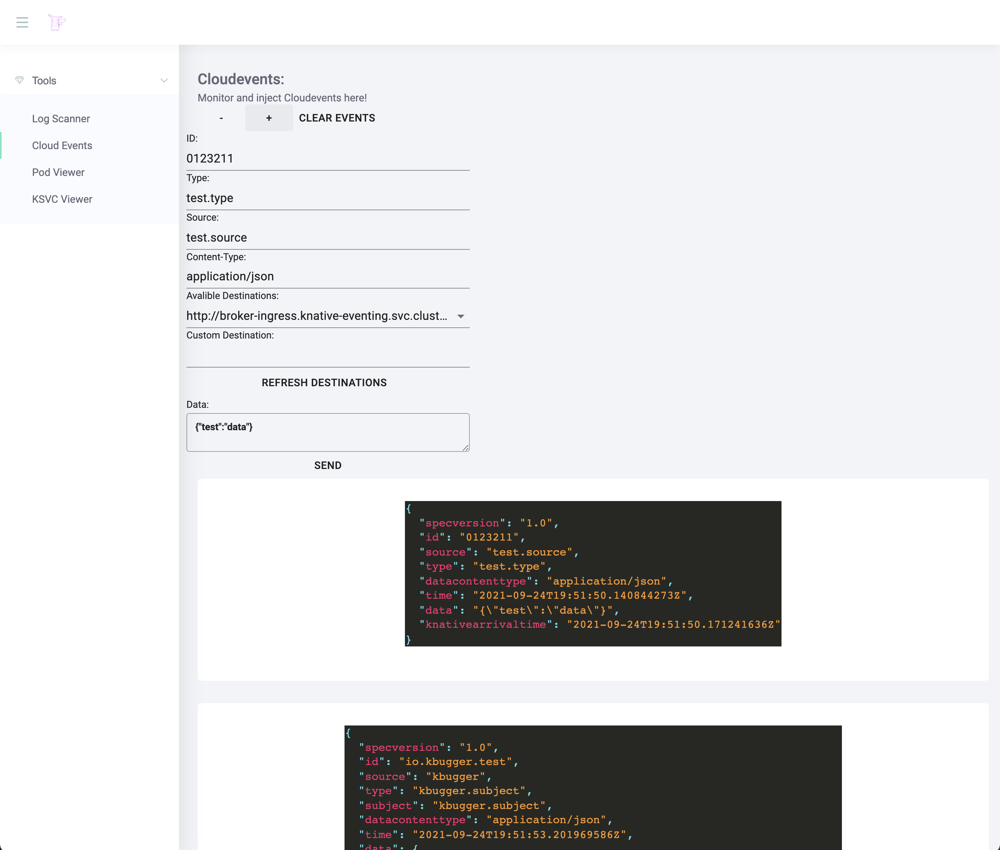

* View active Pods 

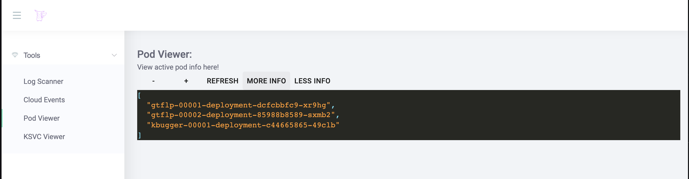

* View info about the active pods

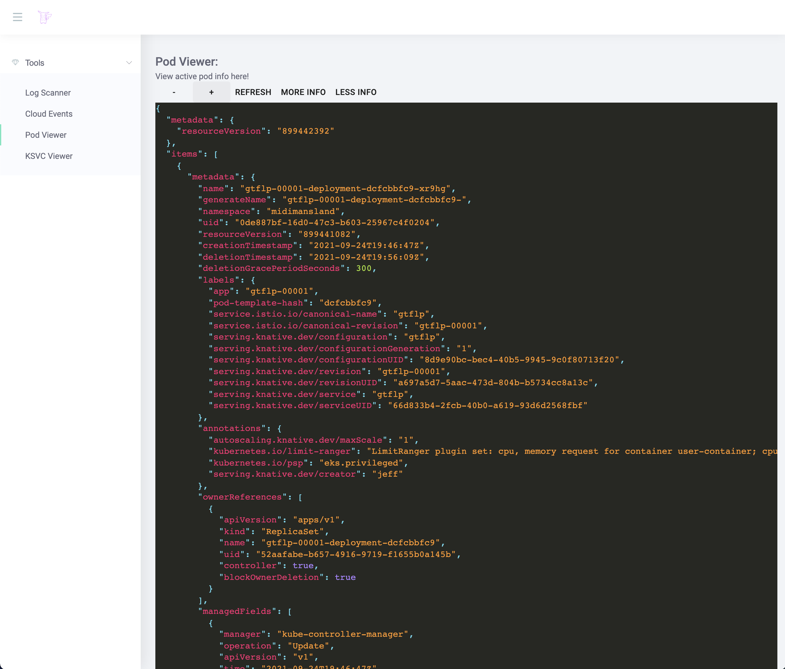

* View Knative Service deployments

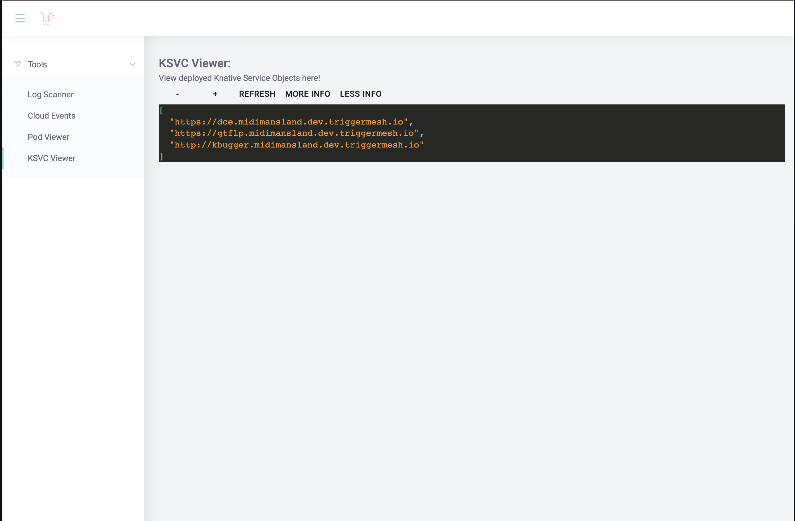

* View info about the KSVC deployments

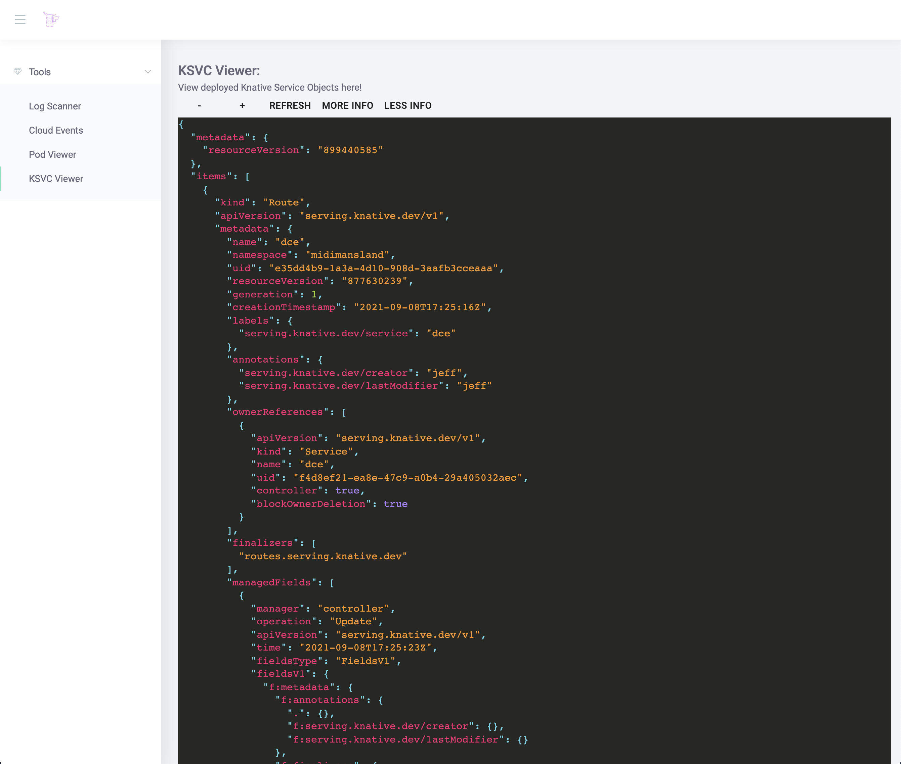

* View Brokers 

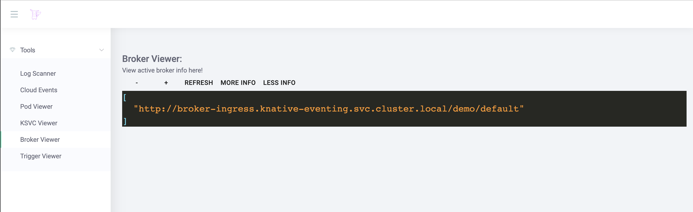

* View info about the Brokers

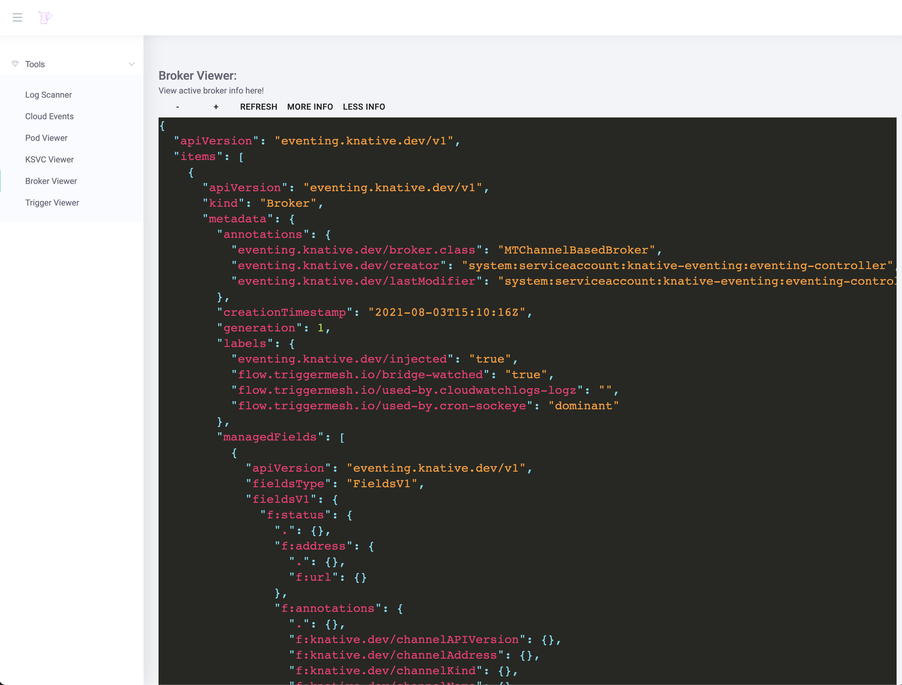

* View Triggers 

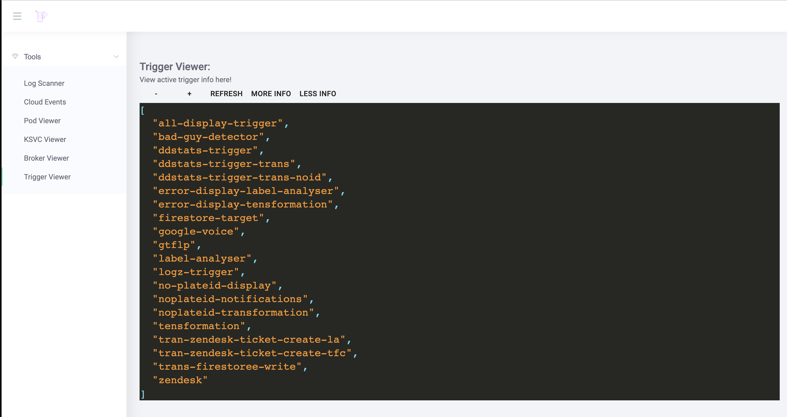

* View info about the Triggers

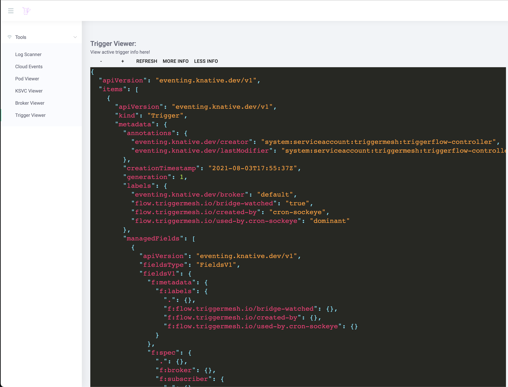

* View Bridges 

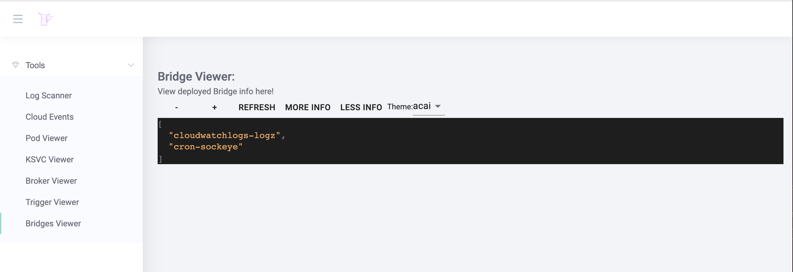

* View info about the Bridges

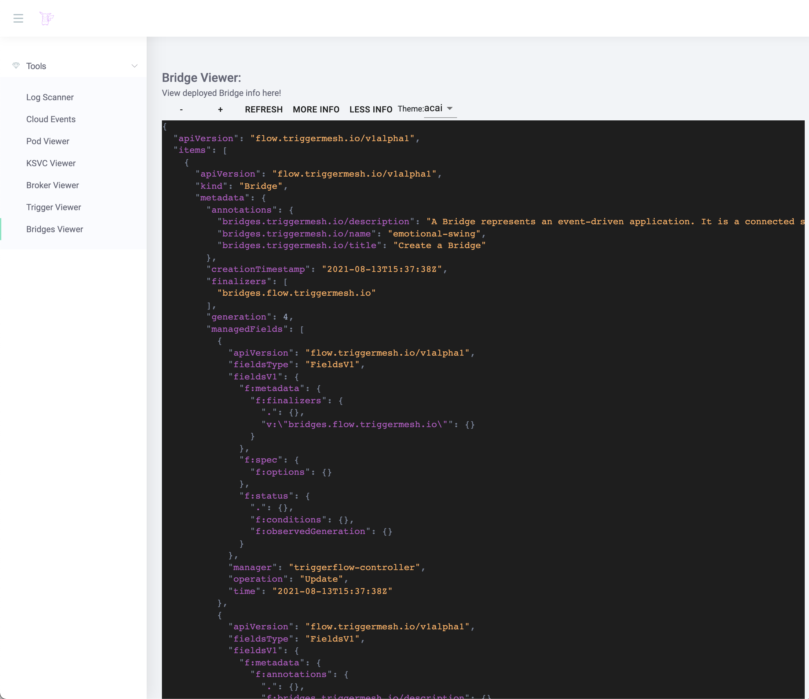

* View Deployed Sources 

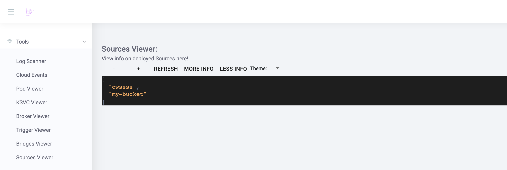

* View info about the Sources

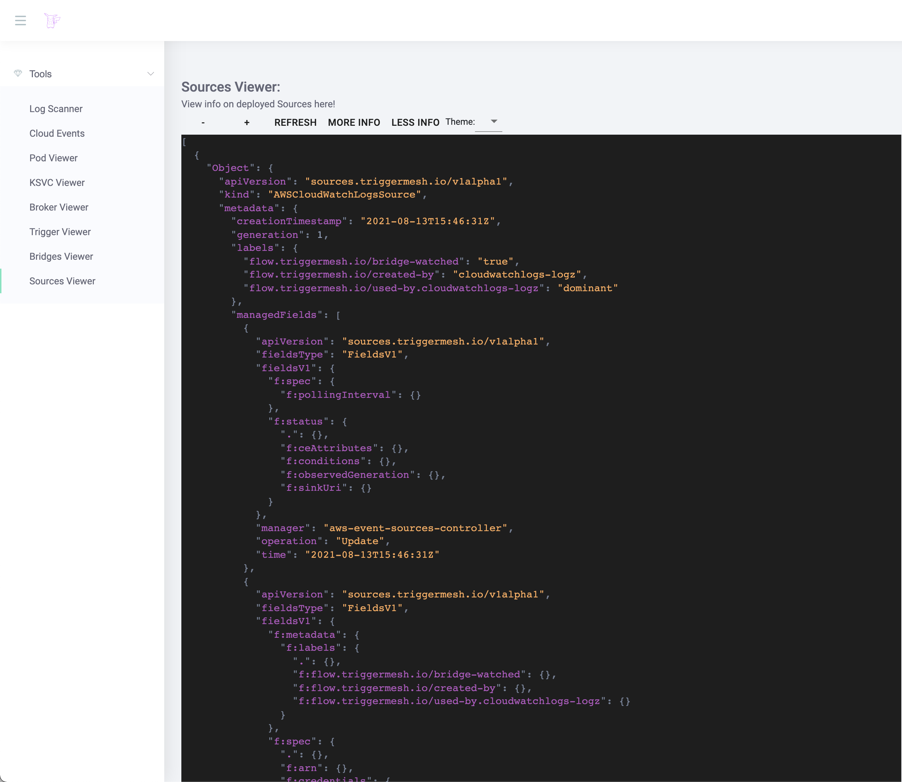

* List resources by providing a custom Grop Version Resource

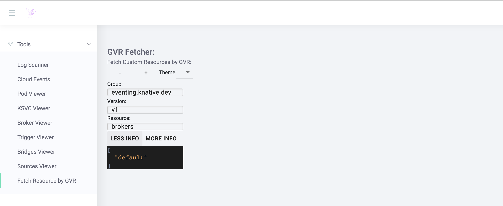

* View information about resources by providing a custom Grop Version Resource

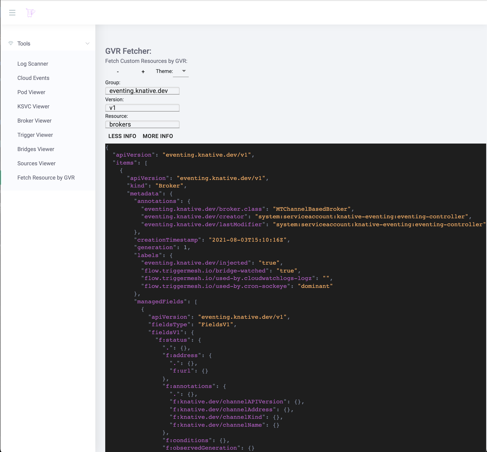

## Prerequisites

### To deploy

* [kubectl](https://kubernetes.io/docs/tasks/tools/install-kubectl/)
* [Kubernetes](https://kubernetes.io/)
* [Knative](https://knative.dev/)

### To develop

* [go](https://go.dev/learn/)
* [yarn](https://yarnpkg.com/getting-started/install)
* [make](https://www.gnu.org/software/make/)
* [ko](https://github.com/google/ko) 
* [docker](https://docs.docker.com/get-started/) or [gcloud](https://cloud.google.com/sdk/docs/quickstart)

## How to use it
### Deploy from manifest

1. Download the `release.yaml` from the most current [releases.](https://github.com/JeffNeff/gtflp/releases) 

1. Update line 74 of file `release.yaml` with the correct namespace.

1. Apply the manifest:

        kubectl -n <namespace> apply -f release.yaml
    
1. After applying the manifest, retreive the url with the following command:

        kubectl -n <namespace> get ksvc

1. It should return something similar to the following:

        NAME         URL                                          LATESTCREATED      LATESTREADY        READY   REASON
        gtflp        https://gtflp.demo.dev.triggermesh.io        gtflp-00002        gtflp-00002        True    
  
1. Open the url in your browser.

Note: The image located at gcr.io/fit-stream-305821/gtflp is kept up to date with this repo via Github Actions, on each merge with master. If you want to deploy an image that gets regular updates. Use this one. 

### Deploy from Triggermesh

1. Login to [triggermesh.](cloud.triggermesh.io)

1. Navigate to the [Bridges](https://cloud.triggermesh.io/bridges) page.

1. Select "New Bridge" in the top right corner, next to "Refresh".

1. Select "Create a New Bridge".

1. Select "Target".

1. Select the `Services` item.

1. Select `gtflp` from the "Image Catalog" dropdown. 

1. Save.

1. Select "Submit Bridge" in the top right corner, next to "Refresh".

1. Navigate to the [Services](https://cloud.triggermesh.io/services) page.

1. Select `gtflp` (or whatever you named the deployment).

1. On this page in the "Routes" card you can note the deployment URL listed as "Domain".

1. Navigate to this URL.

1. Enjoy a quality deubbing experience. 

**Note** If you leave the deployment name as `gtflp` then the logs will be hidden from the UI. 
If you want to show logs from the `gtflp` pod, then chagne the name of the deployment to something else. 

## Development
### Frontend

    cd frontend
    yarn install
    yarn start

To build the frontend and update the static files located in `/cmd/gtflp/kodata`.

    make update-static

### Backend

    export CLUSTER_NAME=<cluster-name>
    KO_DATA_PATH=cmd/gtflp/kodata/ go run ./cmd/gtflp
    
Or

    export CLUSTER_NAME=<cluster-name>
    make debug

### Releaseing

1. Create a `release.yaml` file in the root directory:
  
    make release
    
1. Update line 74 of file [gtflp.yaml](./config/gtflp.yaml ) with the correct namespace before applying. 

**Note** If you leave the deployment name as `gtflp` then the logs will be hidden from the ui. 
If you want to show logs from the `gtflp` pod, then chagne the name of the deployment to something else. 

## Contributing

Please [open an issue](https://github.com/JeffNeff/gtflp/issues/new) if you have any questions or suggestions!
Or feel free to fork and PR!
