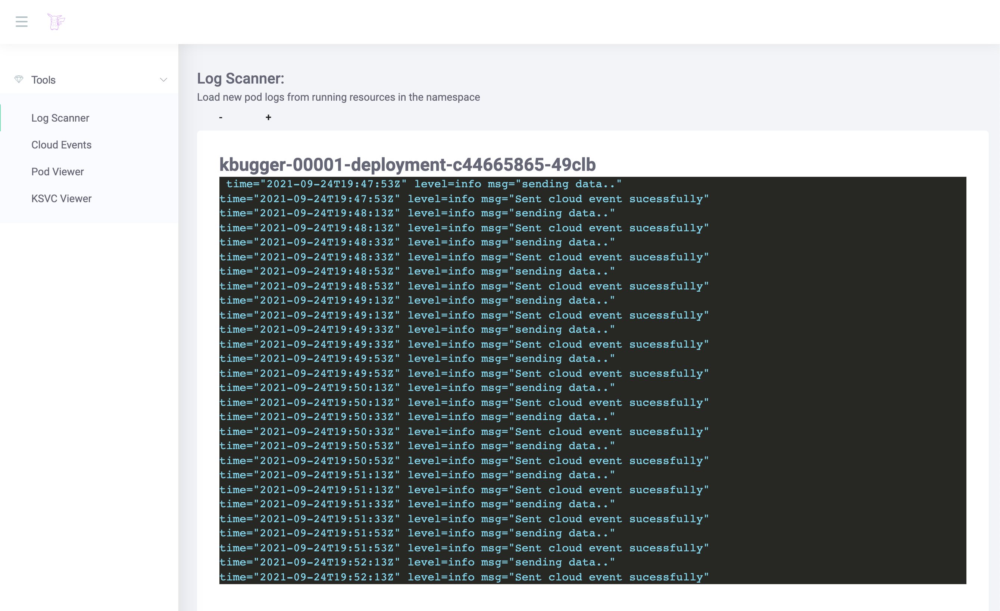

                                                 __    _____.__          
                                           _____/  |__/ ____\  | ______  
                                          / ___\   __\   __\|  | \____ \ 
                                         / /_/  >  |  |  |  |  |_|  |_> >
                                         \___  /|__|  |__|  |____/   __/ 
                                        /_____/                  |__|    

 
## What it is

Tired of `kubectl -n <ns> logs <pod> user-container`ing all the time? 

Try `gtflp`!

`gtflp` serves to stream the logs from pods in the same namespace as the gtflp deployment. Allowing you to monitor
pod logs in a single window. 

## Prerequisites

### To deploy

* [kubectl](https://kubernetes.io/docs/tasks/tools/install-kubectl/)
* [Kubernetes](https://kubernetes.io/)
* [Knative](https://knative.dev/)

### To develop

* [ko](https://github.com/google/ko) 

## How to use it

1. Clone this repo, or download the `release.yaml` from the most current [releases](https://github.com/JeffNeff/gtflp/releases/tag/v0.1) 

    git clone https://github.com/JeffNeff/gtflp.git

1. Update line 41 of file [release.yaml](./release.yaml) with the correct namespace

1. apply the manifest:

        kubectl -n <namespace> apply -f release.yaml
    
1. After applying the manifest, retreive the url with the following command:

        kubectl -n <namespace> get ksvc

1. It should return something similar to the following:

        NAME         URL                                          LATESTCREATED      LATESTREADY        READY   REASON
        gtflp        https://gtflp.demo.dev.triggermesh.io        gtflp-00002        gtflp-00002        True    
  
1. Open the url in your browser.

## Development

### Frontend

    cd frontend
    yarn install
    yarn start

To build the frontend and update the static files located in `/cmd/gtflp/kodata`.

    make update-static

### Backend
    
    export DEV=true
    export NAMESPACE=<namespace>
    KO_DATA_PATH=cmd/gtflp/kodata/ go run ./cmd/gtflp
or
    make debug

### Releaseing

Update line 41 of file [gtflp.yaml](./config/gtflp.yaml ) with the correct namespace.

    make release

### Deploying to Kubernetes

    ko -n <ns> apply -f config/

**Note** If you leave the deployment name as `gtflp` then the logs will be hidden from the ui. 
If you want to show logs from the `gtflp` pod, then chagne the name of the deployment to something else. 

## Contributing

Please [open an issue](https://github.com/JeffNeff/gtflp/issues/new) if you have any questions or suggestions!
Or feel free to fork and PR!
